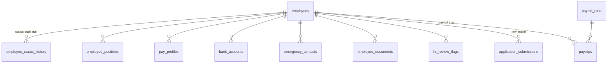

# Onni Payroll — 3-tier docker compose

| Tier | Tech | Container |
|------|------|-----------|
| ui | React (Vite) SPA served by nginx, proxies `/api` to the backend | `ui` → http://localhost:8077 |
| backend | FastAPI JSON API (payroll engine, auth, PDFs, seeding) | `backend` (internal :8000) |
| db | PostgreSQL 16 | `db` (volume `pgdata`) |

## Run

```bash
docker compose up -d --build
open http://localhost:8077
```

Demo accounts: `preparer/preparer123` · `approver/approver123` · `admin/admin123`

On first start the backend seeds users and imports employees from
`backend/employee-registration-form.xlsx`, then applies the active roster.
Data persists in the `pgdata` volume; `docker compose down -v` wipes it.

## Development outside docker

- backend: `cd backend && pip install -r requirements.txt && python seed.py && uvicorn app.main:app --reload`
  (uses a local SQLite file unless `DATABASE_URL` is set)
- ui: `cd ui && npm install && npm run dev` (Vite dev server on :5173, proxies `/api` to :8000)

`webapp/` is the previous monolithic (Jinja + SQLite) version, kept for reference.

---

# Employee Master Database + Registration PWA

The Supabase prod Postgres (`.env → DATABASE_URL`) is the single source of
truth for employee master data. The payroll engine reads from it; new staff
register through the public PWA; HR reviews and approves in the dashboard.

## Schema



Migrations live in `supabase/migrations/*.sql` (additive, idempotent; applied
with `psql -f`). Money is integer **sen**; NRIC/bank/phone are **TEXT** always
(the legacy data was corrupted by spreadsheet number cells). RLS is enabled
deny-by-default on every table — proven by `supabase/rls_test.sql`; the
backend is the only DB client, and enforces roles at the API layer.

## Status lifecycle

```
applicant → pending_review → active → resigned | terminated | absconded
applicant | pending_review → rejected
```

Enforced by a DB trigger (`check_status_transition`). Approval
(`POST /api/hr/employees/{id}/approve`) is the only path to `active` and
requires: no open **blocker** flags, a **verified** bank account, a position,
and pay details; it writes `employee_positions`, `pay_profiles`, and the
status history row. Resignation requires notice date + last working day.
Nobody is ever deleted.

## Flag catalog

| flag_type | severity | raised when |
|---|---|---|
| `invalid_identity_no` | info/blocker | NRIC recovered from a corrupted cell / fails 12-digit-date check |
| `corrupted_bank_account` | warning/blocker | numeric-cell account, swapped name/account, 15-16-digit float-precision values |
| `unverified_bank_account` | blocker | every imported/self-submitted account until HR verifies |
| `work_authorization_review` | blocker | passport/UNHCR holder — verify permit before activation |
| `missing_document` | info→blocker | food-handler cert / typhoid proof absent (KKM requirement) |
| `typhoid_expiring` / `typhoid_expired` | warning / blocker | expiry within 30 days / past (daily `raise_expiry_flags()`) |
| `work_permit_expiring` | warning | expiry within 60 days |
| `ambiguous_salary` | warning | expected-salary text unparseable / mixes hourly+monthly |
| `suspicious_dob` | warning | DOB = submission date, age <15 or >70 |
| `duplicate_suspect` | blocker | same NRIC/email/phone as another record |

## Re-running the legacy import

```bash
cd backend
DATABASE_URL=postgresql+psycopg://... python import_legacy_form.py
```

Idempotent (keyed on `application_submissions.reference_no = GF-<row>`);
re-runs refresh satellite rows and never duplicate. Every recovery/guess
raises a flag — zero silent fixes. Legacy document files are still Google
Drive links (`employee_documents.source_url`); migrating the binaries into
the `employee-docs` bucket is pending (flagged per employee).

## Monthly payroll routine (clerk)

1. HR → Compliance board: clear expiring documents and the
   "blocked from payroll" list (verify bank accounts, resolve flags).
2. Download **Master CSV** and **Movements CSV** for the month
   (`/api/payroll-export/master?year=&month=`). Movements lists the month's
   new hires and leavers (final-pay reminder).
3. Create the payroll run as usual; key in only part-time **hours** and **OT
   hours**. Blocked employees never appear in the master export.

## Registration PWA

Public form at **`/register`** (EN + BM) — installable (manifest + service
worker), drafts persist to IndexedDB on every keystroke, and a submission
made offline is queued and auto-sent when the connection returns. Documents
upload to the private `employee-docs` Supabase Storage bucket (signed URLs
only; set `SUPABASE_URL` + `SUPABASE_SERVICE_KEY` in `.env` to enable).

HR dashboard at **`/hr`** (admin/approver): review queue with flags, detail
view, resolve/dismiss, verify bank, approve/reject, resignation workflow,
compliance board, CSV exports.
